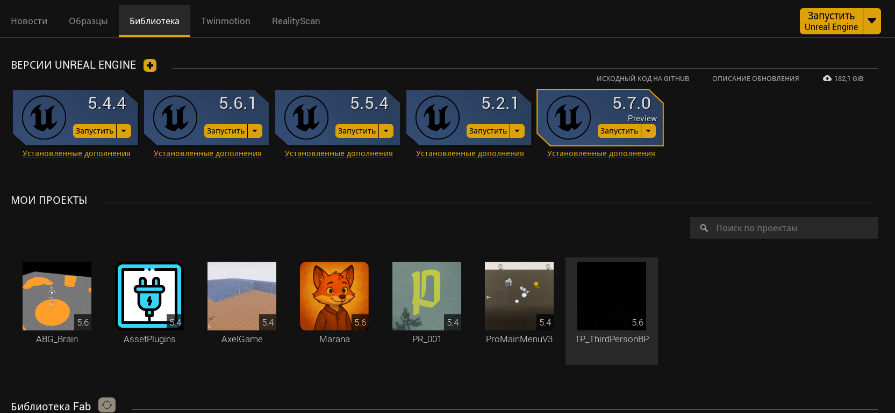
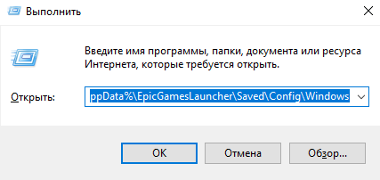
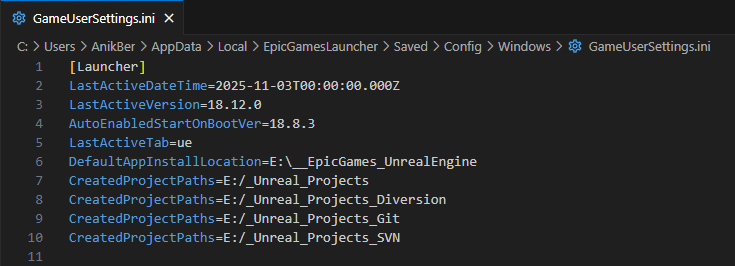
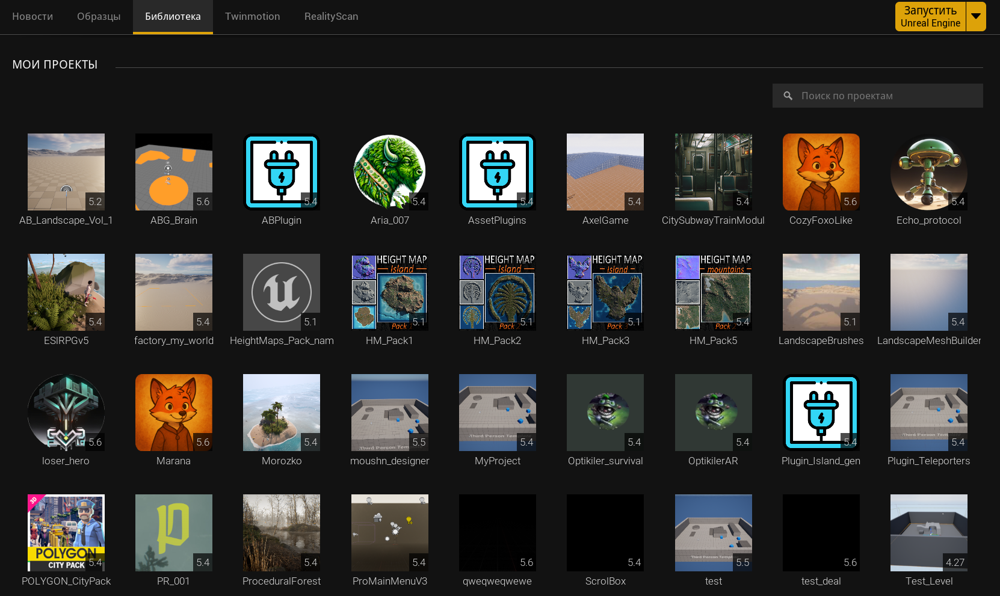

<p align="center">
  <strong>-------></strong> 
  <a href="/README_en_EN.md">English</a> | 
  <a href="/README.md">Русский</a> 
  <strong><-------</strong>
</p>

<p align="center">
  <picture>
    <source media="(prefers-color-scheme: dark)" srcset="./media/logo-dark.png">
    
  </picture>
</p>

---

<div align="center">

[](https://github.com/AnikBeris)
[](/LICENSE.md)
[](https://github.com/AnikBeris)

</div>


<h1 align="center"> 
🚀 Восстановление проектов Unreal Engine после переустановки Epic Games Launcher 
</h1>

<h2 align="center">
Этот материал объясняет, как вернуть исчезнувшие проекты Unreal Engine после переустановки <code>Epic Games Launcher</code> — без необходимости открывать каждый вручную.
</h2>

<h2 align="center">
> 💡 Руководство предназначено для разработчиков, у которых десятки проектов Unreal Engine, и которые хотят быстро восстановить их отображение в лаунчере через редактирование конфигурационных файлов.
</h2>


* * * * * * * * * * * * * * * * * * 
* * * * * * * * * * * * * * * * * * 


> **⚠️ Внимание отказ от ответственности:** Автор не несёт ответственности за возможные последствия.

**Если этот проект оказался полезным для Вас, вы можете оценить его, поставив звёздочку.**:star2:

<p align="left">
  <a href="https://pay.cloudtips.ru/p/7249ba98" target="_blank">
    
  </a>
</p>

Пожертвования горячо приветствуются, какими бы маленькими они ни были, и большое спасибо. 😌

| | |
|-------------:|:-------------|
| **Tether USDT (BEP20)** |`0x22258ea591966e830199d27dea7c542f31ed5dc5`|
| **Bitcoin (BTC)** |`1Dbwq9EP8YpF3SrLgag2EQwGASMSGLADbh`|
| **Ethereum (ERC20)** | `0x22258ea591966e830199d27dea7c542f31ed5dc5`|
| **Binance Smart Chain (BEP20)** | `0x22258ea591966e830199d27dea7c542f31ed5dc5`|
| **Solana (SOL)** | `yYYXsiVTzsvfvsMnBxfxSZEWTGytjAViE2ojf3hbLeF`|
| **Cloud tips** | [cloudtips](https://pay.cloudtips.ru/p/7249ba98) |
| | |


* * * * * * * * * * * * * * * * * * 
* * * * * * * * * * * * * * * * * * 


## 📚 Содержание

1. [Проблема: пропавшие проекты](#-1-проблема-пропавшие-проекты)
2. [Где хранится список проектов](#-2-где-хранится-список-проектов)
3. [Как работает параметр CreatedProjectPaths](#-3-как-работает-параметр-createdprojectpaths)
4. [Дополнительные советы](#-4-дополнительные-советы)
5. [Итог](#-5-итог)

---

## 🔗 Полезные ссылки
- [Документация Unreal Engine — Project Browser](https://dev.epicgames.com/documentation/en-us/unreal-engine/unreal-engine-5-6-documentation?application_version=5.6)
- [Epic Games Launcher Config Path (Windows)](https://rhyce.dev/blog/fix-unreal-projects-not-showing-in-the-epic-games-launcher/)
- [Форум Unreal Engine — решение проблемы исчезнувших проектов](https://forums.unrealengine.com/)

* * * * * * * * * * * * * * * * * * 
* * * * * * * * * * * * * * * * * * 


# 🚀 История о том, как я восстанавливал проекты Unreal Engine после переустановки Epic Games Launcher

[⬆️ Наверх](#-содержание)

## 🧭 1. Проблема: пропавшие проекты




После переустановки **Epic Games Launcher** я обнаружил, что раздел *"Мои проекты"* стал пустым.  
Файлы проектов никуда не делись — все `.uproject` были на месте, но сам лаунчер "забыл", где они находятся.

Проблема заключается в том, что **Epic Launcher не сканирует системные диски автоматически** после переустановки.  
Он хранит список директорий проектов в конфигурационном файле, который удаляется вместе с настройками лаунчера.


---

[⬆️ Наверх](#-содержание)

## 🗂 2. Где хранится список проектов

Чтобы вернуть все проекты обратно, нужно найти и отредактировать один файл `GameUserSettings.ini`.

- Одновременно нажимем `Win + R` откроется окно для ввода

- Потом ввидите путь до файла `GameUserSettings.ini`

```sh
%LocalAppData%\EpicGamesLauncher\Saved\Config\Windows
```


- Проверьте что у вас закрыт **Epic Games Launcher** и что его нет в `диспетчере задач`

- Открой фаил `GameUserSettings.ini` любым текстовым редактором и найди раздел:


```sh
[Launcher]
```

- Найдите в разделе `[Launcher]` строки с `CreatedProjectPaths=`
- под строками `CreatedProjectPaths=` можно прописать свою **папку с проектами**.  

### Пример, как должны выглядеть строки:

```sh
CreatedProjectPaths=D:/UnrealProjects
CreatedProjectPaths=E:/UE5_Projects
CreatedProjectPaths=F:/Backup/Unreal
```

### Пример, как у меня это выглядет:

```sh
[Launcher]
LastActiveDateTime=2025-11-03T00:00:00.000Z
LastActiveVersion=18.12.0
AutoEnabledStartOnBootVer=18.8.3
LastActiveTab=ue
DefaultAppInstallLocation=E:\__EpicGames_UnrealEngine
CreatedProjectPaths=E:/_Unreal_Projects
CreatedProjectPaths=E:/_Unreal_Projects_Diversion
CreatedProjectPaths=E:/_Unreal_Projects_Git
CreatedProjectPaths=E:/_Unreal_Projects_SVN
```



После этого сохрани файл и запусти **Epic Games Launcher** — все проекты из этих директорий появятся автоматически в списке.




---

[⬆️ Наверх](#-содержание)

## 🧩 3. Как работает параметр `CreatedProjectPaths`


Каждая строка `CreatedProjectPaths` сообщает лаунчеру, в какой папке искать `.uproject` файлы.  
Важно: путь должен указывать **на папку с проектами**, а не на конкретный `.uproject`.

Если у вас, как у меня, больше 60 проектов, то можно добавить несколько строк подряд.  
Launcher сам просканирует все указанные директории.

После этого:

1. Закройте лаунчер, если он запущен.  
2. Отредактируйте файл `GameUserSettings.ini`.  
3. Сохраните изменения.  
4. (По желанию) установите файлу атрибут **только для чтения**, чтобы лаунчер не перезаписал настройки.  
5. Запустите **Epic Games Launcher** — проекты должны появиться в разделе *"Мои проекты"*.


---

[⬆️ Наверх](#-содержание)

## 🛠 4. Дополнительные советы

- Храните все проекты в одной или нескольких структурированных папках, например:
  ```
  D:/UnrealProjects/Personal
  D:/UnrealProjects/Client
  D:/UnrealProjects/Tests
  ```
- После ручного добавления путей **создайте новый проект** — иногда это заставляет лаунчер обновить список.
- Если лаунчер не видит проекты — проверьте, чтобы пути были указаны без ошибок и в правильном регистре.
- Для резервного копирования можно сохранить свой `GameUserSettings.ini`, чтобы быстро восстановить пути после следующей переустановки.

> 💡 Это экономит время, особенно если ты работаешь с большим количеством тестовых или архивных билдов Unreal Engine.


## 📜 Лицензия
Этот проект распространяется по [MIT License](/LICENSE).

---

Для детальной документации ознакомьтесь с **------->** [English](/README_en_EN.md) | [Русский](/README.md) **<-------**


